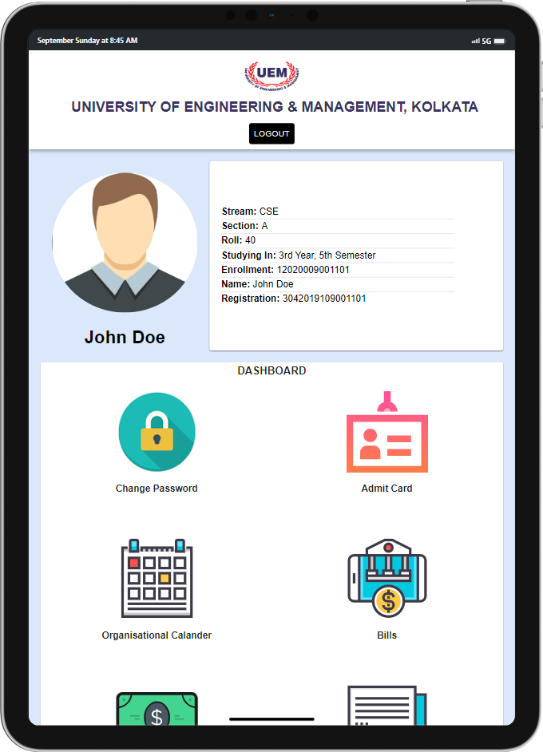

    updated: Tuesday, 1st November 2022

    
    
Good Education, Good Jobs

    

# [UEMCRP](https://uemcrp.netlify.app)

## What's new?

- Unit test Details
- SideBar in Organisational Calendar
- User image update feature
- Calendar Holiday List Logic

## Table of Contents

- [Introduction](#introduction)
- [Acknowledgement](#acknowledgement)
- [Demo](#demo)
- [Design](#design)
- [Tech Stack Used](#tech-stack-used-💻)
- [Contributing](#contributing)
- [Setup](#setup)
- [Best Contributors](#best-contributors-🎭)

## Introduction

- This Repository is participating in Hacktoberfest 2022 so make sure to Star this repo and Jump right into the developement.
- We are aiming to recreate our college ERP System using React and Material UI.
- The current layout of our college ERP is not so much user friendly.
- It was built with desktop perspectives, hence it lacks mobile Friendliness.
- This is an open source project based on MERN stack, so please feel free to contribute to it. 
- For more info about HacktoberFest. Check out [here](https://hacktoberfest.com) 🍾🥂

---

## Acknowledgement

- Original page: [iemcrp]
- Team members and their future endevours
- Open Source For The Win 🌟🌟

---

## Demo

1. **Desktop Layout**

2. **Responsive Layout**

  | **Tablet Layout** | **Mobile Layout** |
  |:-----------------:|:-----------------:|
  |                |             |

---

## Design

- [Design Files in Figma](https://www.figma.com/file/UuiAL0DJCWWIyKnDZWOFb9/UEMCRP?node-id=1%3A387)

## Tech Stack Used 💻

---

## Contributing

- **Take a look at the [Contributing Guidelines](CONTRIBUTING.md) for proper contributions.**

---

## Setup

- **Take a look at the [Setup Guidelines](rules/SETUP.md) to setup the react app locally.**

---

## Best Contributors 🎭

---
## Support 🙏

This project needs a ⭐️ from you. Don't forget to leave a star ⭐️

---

## License

see [LICENSE]

## Happy Hacking !! 🌠

[license]: https://github.com/warmachine028/uemcrp/blob/main/LICENSE
[iemcrp]: https://www.iemcrp.com/
